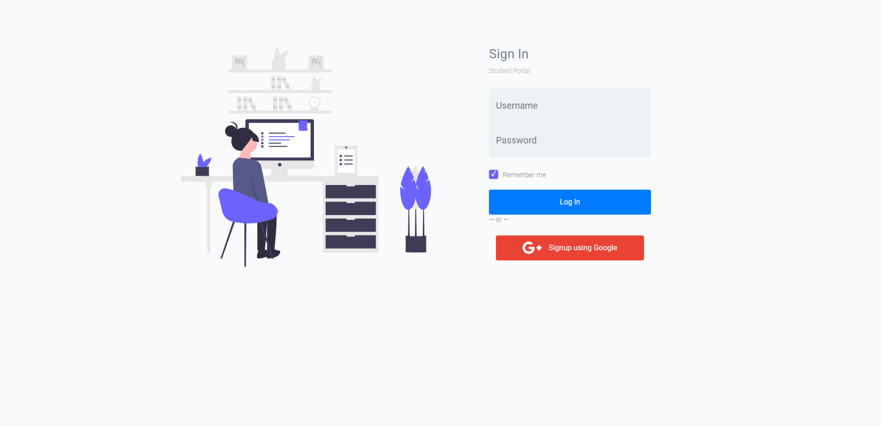
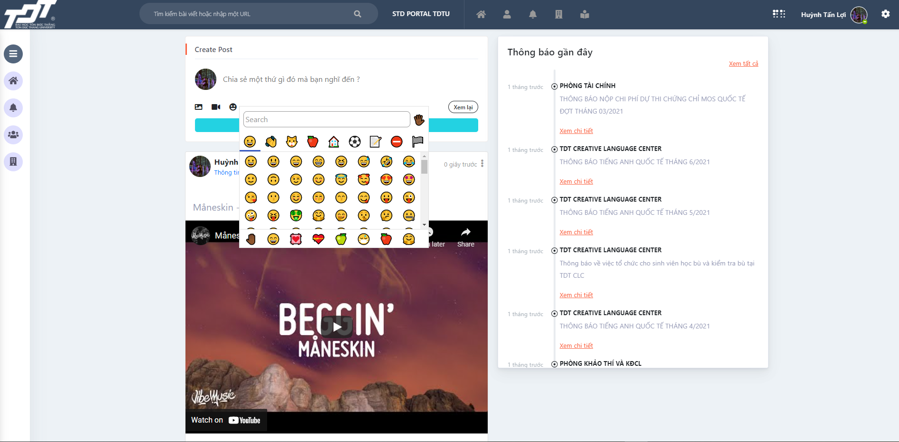
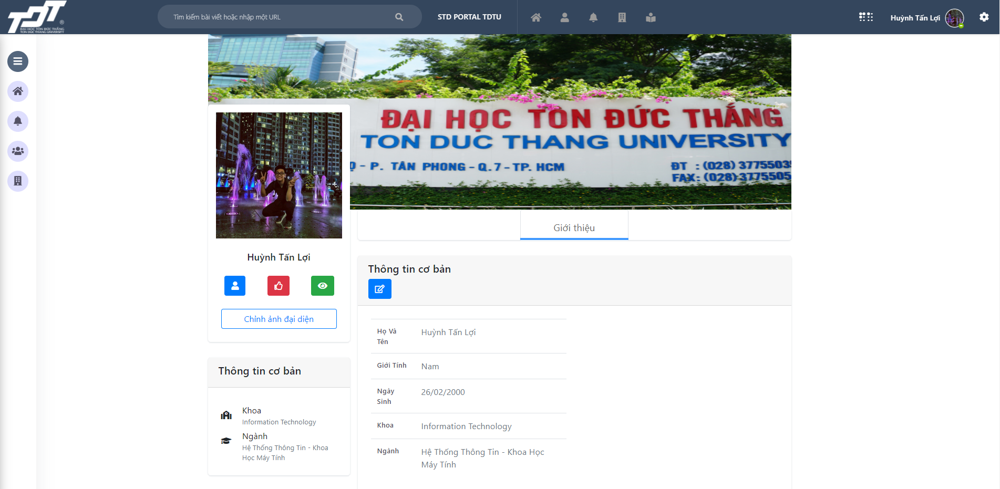
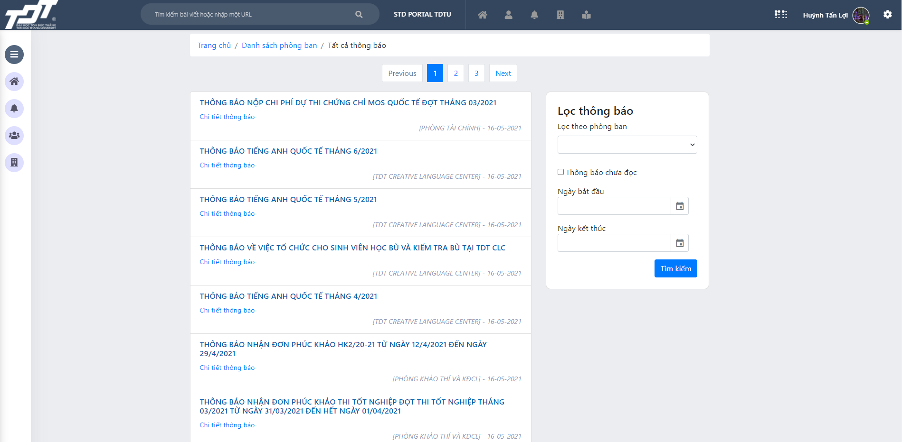
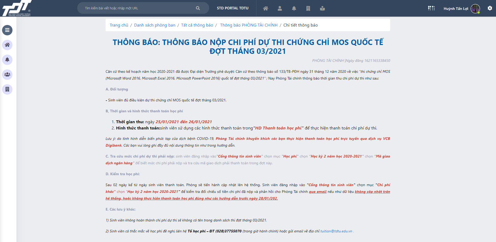
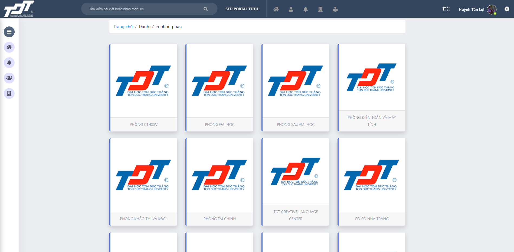
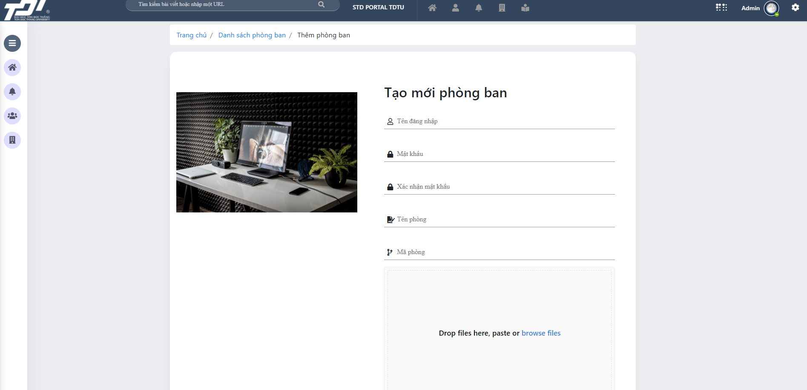

  # STUDENT SOCIAL NETWORK

  ## INTRODUCTION

  With COVID, the situation is becoming more and more complicated, it is necessary to increase the interaction between students on the online platform. Improve the notification system (Notification) existing in the student information system (Student Portal), adding features to help students change, interact online and receive support. support from Better Than School.

  This system can be considered as a miniature social network where the school can post announcements, and students can post to exchange and share.

  ## TOOLS

  NodeJS Framework

  MongoAtlas

  Cloudinary

  Heroku

  Website: <a>https://tdtu-social-network.herokuapp.com</a>

  ## FUNCTION

  The website is fully responsive for each page, with left menu bar, right menu bar, other options, ...

  ### Login Page
  * Log in with your school student email
  * Log in with an account authorized by admin

    

  ### Home Page
  * Add a post
  * Add a post with photo
  * Add a post with video youtube
  * Add emoji into post
  * Post Likes
  * Comment on a post
  * Edit, delete my post
  * Edit, delete my comment

  

  ### Personal Page
  * See other people's background information
  * Edit information, update avatar

  

  ### Notification Page
  * Display the list of notifications of all departments
  * Notification classification table by department
  * Delete notifications (only admin account)

  

  ### Detail Notification Page
  * Basic information of a school announcement

  

  ### Department Page
  * Show list of departments

  

  ### Add Department Page
  * Add account department for the school (only admin account)
  * Grant permission to edit, add notifications from other departments (only admin account)

  

